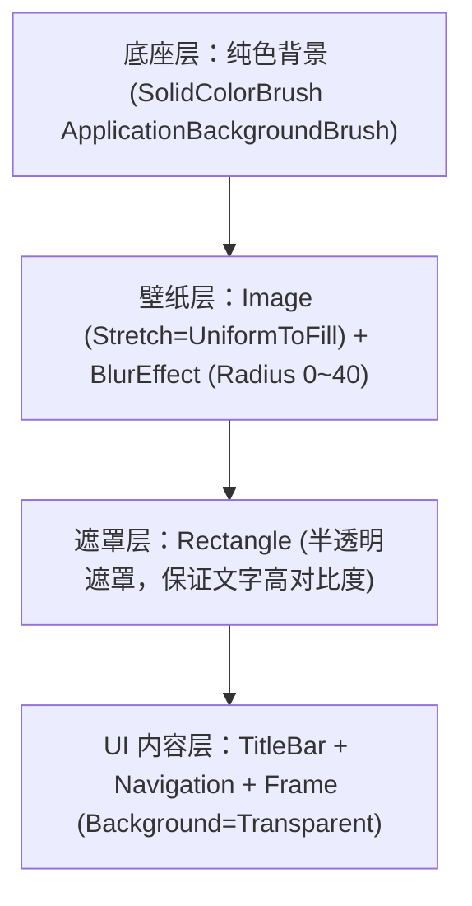

# 调研报告：启动器自主壁纸与高斯模糊遮罩架构 (Launcher Custom Wallpaper & Blur Architecture)

> **调研目标**：回应用户关于“壁纸应由玩家自主设置，包含模糊度调节，而非由主题包全屏暴力捆绑覆盖”的设计意图，系统性梳理现状根因、一手来源，并给出工程化落地的技术实现架构方案。
> **参考技能**：`/research`、`/codebase-design`

---

## 1. 现状剖析与问题根因 (一手来源审计)

### 1.1 现状代码链路
在当前的实现中，主题包中的壁纸被直接赋予给全局设计代币 `ApplicationBackgroundBrush`：
- **来源**：[`Services/ThemeService.cs:258-259`](file:///d:/Agent-工作目录/DevelopMyUNMultiplayerModAndModloader/启动器/UnturnedModManager/Services/ThemeService.cs#L258-L259)
  ```csharp
  var imageBrush = new ImageBrush(bitmap) { Stretch = Stretch.UniformToFill };
  dictionary["ApplicationBackgroundBrush"] = imageBrush;
  application.Resources["ApplicationBackgroundBrush"] = imageBrush;
  ```
- **多层重复绘制**：
  启动器主窗口与所有二级页面均绑定了 `Background="{DynamicResource ApplicationBackgroundBrush}"`：
  - [`MainWindow.xaml:2`](file:///d:/Agent-工作目录/DevelopMyUNMultiplayerModAndModloader/启动器/UnturnedModManager/MainWindow.xaml#L2)
  - [`Pages/SettingsPage.xaml:7`](file:///d:/Agent-工作目录/DevelopMyUNMultiplayerModAndModloader/启动器/UnturnedModManager/Pages/SettingsPage.xaml#L7)
  - [`Pages/HomePage.xaml:6`](file:///d:/Agent-工作目录/DevelopMyUNMultiplayerModAndModloader/启动器/UnturnedModManager/Pages/HomePage.xaml#L6)
  - 以及 `ModListPage`, `AboutPage`, `TaskCenterPage`, `CommunityPage` 等全部 8 个页面。
- **后果**：
  1. **层叠重复绘制 (Overdraw)**：当玩家打开“设置”页时，`MainWindow` 画了一整张壁纸，嵌入 Frame 的 `SettingsPage` 又重画了一遍，造成显存与渲染管线的双重浪费。
  2. **信息清晰度破坏 (Readability Collapse)**：设置卡片等容器具有 `0.92` 的透明度，满铺的大图壁纸（如气泡、大块插画）直接透穿至设置项文字背后，严重违反启动器作为“高效、克制、高可用工具”的产品属性。
  3. **职责错配 (Responsibility Misplacement)**：壁纸强行侵占了调色板（Palette）与设计代币总线。

---

## 2. 玩家自主壁纸方案与架构重构设计

根据用户的清晰意图：**“壁纸可以玩家自己设置，包括模糊程度之类的”**，我们确立正交解耦架构：

### 2.1 职责分离原则 (Decoupling Principles)
1. **主题包（.ummtheme）**：
   - 专精于**色彩代币（Color Tokens）**与**卡片几何形态（Card Geometry）**；
   - 彻底不再强制覆盖 `ApplicationBackgroundBrush`；
   - `ApplicationBackgroundBrush` 始终保持为纯色 `SolidColorBrush`（由主题包的 `BackgroundColor` 与 `LightBackgroundColor` 驱动）。
2. **壁纸系统（Launcher Wallpaper Host）**：
   - 完全归属于**用户本地个性化配置（User Personalization）**；
   - 独立于主题包之外，由玩家在“设置”页主动选取本地任意图片；
   - 由主窗口统一渲染且仅渲染一层，二级页面背景保持纯透（Transparent）。

### 2.2 宿主分层渲染管道 (Single Host Layer Pipeline)
在 [`MainWindow.xaml`](file:///d:/Agent-工作目录/DevelopMyUNMultiplayerModAndModloader/启动器/UnturnedModManager/MainWindow.xaml) 根容器建立 3 层视觉栈：



#### XAML 布局实现原型：
```xml
<Grid>
    <!-- Layer 0: 纯色兜底底色 -->
    <Border Background="{DynamicResource ApplicationBackgroundBrush}" />

    <!-- Layer 1: 独立壁纸宿主层（仅在此处绘制一次） -->
    <Image x:Name="LauncherWallpaperImage"
           Stretch="UniformToFill"
           Visibility="{Binding HasCustomWallpaper, Converter={StaticResource BooleanToVisibilityConverter}}">
        <Image.Effect>
            <!-- 硬件加速高斯模糊特效 -->
            <BlurEffect Radius="{Binding WallpaperBlurRadius}" RenderingBias="Performance" />
        </Image.Effect>
    </Image>

    <!-- Layer 2: 柔光/暗色遮罩层（自动依据当前日夜态柔和过渡，保证 WCAG AA 4.5:1 可视度） -->
    <Border x:Name="WallpaperOverlay"
            Background="{DynamicResource ApplicationBackgroundBrush}"
            Opacity="{Binding WallpaperDimOpacity}" />

    <!-- Layer 3: 原有主窗口 UI 根容器（导航条与页面 Frame） -->
    <Grid x:Name="RootWindowContent">
        <!-- 页面 Frame Background 统一设为 Transparent，让高质感模糊壁纸柔和透出 -->
        <Frame x:Name="RootFrame" Background="Transparent" NavigationUIVisibility="Hidden" />
    </Grid>
</Grid>
```

### 2.3 技术指标与性能优化
- **模糊算法**：使用 WPF 原生 `System.Windows.Media.Effects.BlurEffect`，配置 `RenderingBias="Performance"`，调用 GPU Pixel Shader 硬件加速。
- **推荐调节范围**：
  - **模糊半径 (Blur Radius)**：`0`（原图无模糊）~ `40 px`（极高柔化，类似 macOS / Windows Mica 质感），默认值推荐 `15 px`。
  - **遮罩不透明度 (Dim Opacity)**：`0.1`（清透）~ `0.8`（重度暗化/纯净化），默认值推荐 `0.35`。
- **内存安全**：壁纸文件通过 `MemoryStream` 解耦读取并 `Freeze()`，杜绝占用磁盘文件句柄。

### 2.4 设置页（SettingsPage）新增交互方案
在“设置 -> 主题模式与外观”下方扩展“启动器壁纸与个性化”卡片：
1. **壁纸路径选择器**：
   - 显示当前生效壁纸文件名称；
   - 提供 `[选择壁纸...]`（支持 png、jpg、jpeg、webp）；
   - 提供 `[移除壁纸]`（一键恢复纯净纯色 Fluent 外观）。
2. **模糊度调节滑块**：
   - 标注：“背景模糊程度”；
   - Slider：`0 px` 至 `40 px`，实时预览。
3. **遮罩浓度调节滑块**：
   - 标注：“背景遮罩浓度”；
   - Slider：`10%` 至 `80%`，确保再花哨的二次元或游戏插画，也能化为质感极佳的暗调/明调氛围背景，绝不喧宾夺主。

---

## 3. 持久化数据模型定义 (AppSettings Schema)

在 [`AppSettings.cs`](file:///d:/Agent-工作目录/DevelopMyUNMultiplayerModAndModloader/启动器/UnturnedModManager/AppSettings.cs) 的 `ConfigData` 中加入持久化键：

```csharp
// 玩家个人壁纸偏好
public string? LauncherCustomWallpaperPath { get; set; }
public double LauncherWallpaperBlurRadius { get; set; } = 15.0;
public double LauncherWallpaperDimOpacity { get; set; } = 0.35;
```

---

## 4. 结论与实施价值
- **解耦收益**：把壁纸权力还给玩家，主题包只管“调色板、圆角和排版”，彻底消灭“导入主题包却被强制塞入花哨壁纸”的突兀体验；
- **视觉品质跃迁**：引入可控的高斯模糊与遮罩浓度后，启动器正式拥有比肩现代化操作系统原生质感的沉浸式毛玻璃体验！
