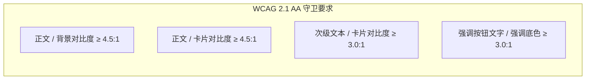

# Unturned Mod Manager (UMM) 主题包与配色设计规格书 (Specification v2.0)

> **版本**：2.0.0
> **状态**：正式发布 (Approved)
> **适用范围**：UMM 启动器主题系统、.ummtheme 导入导出器、在线工坊审核器及社区主题创作者
> **参考标准**：W3C Web Content Accessibility Guidelines (WCAG) 2.1 AA、Microsoft Fluent Design System

---

## 1. 概述与设计哲学 (Overview & Philosophy)

`.ummtheme` 是 Unturned Mod Manager 专用的开放式主题数据封装格式。

### 1.1 核心设计原则
1. **纯粹设计代币体系 (Design Tokens Only)**：主题包专精于**色彩、卡片质感、圆角与排版层级**，与用户个人全屏壁纸完全正交解耦，绝不喧宾夺主。
2. **全天候日夜双态自适应 (Dual-Mode Native)**：每一个主题包同时定义“夜间态 (Dark)”与“日间态 (Light)”两套完整的设计代币，跟随启动器运行时无缝流转。
3. **WCAG 2.1 AA 级无障碍守卫 (Accessibility Guard)**：所有官方和社区主题，正文前景色与背景色对比度必须 $\ge 4.5:1$，大号组件/强调按钮必须 $\ge 3.0:1$，严禁出现“黑字暗底”或“孤岛默认蓝”。
4. **确定性向下兼容 (Deterministic Compatibility)**：对缺少日间配置的旧版 v1 主题，提供数学上确定性的自动升权派生算法，零破坏升级。

---

## 2. 物理封装规范 (Physical Archive Specification)

主题包文件扩展名为 `.ummtheme`，物理结构为标准的 ZIP 压缩归档格式：

```text
MyCustomTheme.ummtheme (ZIP Archive)
└── theme.json          [必须] 根目录下唯一的清单描述文件
```

### 2.1 安全沙箱约束 (Sandbox Restrictions)
为了杜绝恶意利用与系统安全风险，导入器执行严格沙箱检查：
- **文件白名单**：归档内仅允许存在 `theme.json` 及合法的静态元数据资产。严禁任何可执行文件、动态链接库或脚本（如 `.exe`, `.dll`, `.bat`, `.cmd`, `.ps1`, `.vbs`, `.js`, `.sh`）。
- **路径防穿透**：严禁包含任何目录穿越符（`..`）或绝对根路径（如 `/`, `C:\`）。
- **解压体积上限**：解压展开总尺寸不得超过 **50 MB**，防止解压炸弹（Zip Bomb）。

---

## 3. 清单数据模型 (theme.json Schema v2)

`theme.json` 采用 UTF-8 编码，标准结构定义如下：

```json
{
  "$schema": "https://unturnedmodmanager.com/schemas/theme-v2.json",
  "id": "sakura_pink",
  "name": "樱花粉调",
  "author": "UMM Official",
  "version": "2.0.0",
  "description": "精雕细琢的双态樱花粉主题。夜间态呈现静谧深李子与柔粉霓虹微光，日间态呈现明澈珍珠白与春樱漫舞。",
  "theme_version": 2,
  "base_theme": "Dark",
  
  "accent_color": "#D83B7E",

  "background_color": "#1A1418",
  "card_background_color": "#261D23",
  "card_opacity": 0.92,
  "card_border_radius": 10.0,

  "light_background_color": "#FFF2F6",
  "light_card_background_color": "#FFFFFF",
  "light_card_opacity": 0.95,
  "light_card_border_radius": 10.0
}
```

### 3.1 字段定义速查表

| 字段名 (JSON Key) | C# 映射属性 | 类型 | 约束 / 取值范围 | 必须 | 说明 |
| :--- | :--- | :--- | :--- | :---: | :--- |
| `id` | `Id` | `string` | `^[a-z0-9_]{3,32}$` | 是 | 主题唯一标识符，小写字母、数字及下划线 |
| `name` | `Name` | `string` | 1 ~ 64 字符 | 是 | 界面展示的主题友好名称 |
| `author` | `Author` | `string` | 1 ~ 64 字符 | 是 | 主题作者或团队署名 |
| `version` | `Version` | `string` | SemVer 规范 (如 `2.0.0`) | 是 | 主题语义化版本号 |
| `description` | `Description` | `string` | <= 500 字符 | 否 | 主题设计灵感与说明文字 |
| `theme_version` | `ThemeVersion`| `int` | `2` (旧版为 1) | 是 | 规范版本号，双模规范固定为 `2` |
| `base_theme` | `BaseTheme` | `string` | `"Dark"` 或 `"Light"` | 是 | 主题作者推荐的首选基底基调 |
| `accent_color` | `AccentColor` | `string` | `^#[0-9A-Fa-f]{6}$` | 是 | 全局强调主色 (Primary Accent) |
| `background_color` | `BackgroundColor` | `string` | `^#[0-9A-Fa-f]{6}$` | 是 | **夜间态**应用级背景底色 |
| `card_background_color` | `CardBackgroundColor` | `string` | `^#[0-9A-Fa-f]{6}$` | 是 | **夜间态**卡片与表面容器底色 |
| `card_opacity` | `CardOpacity` | `double` | `0.20` ~ `1.00` | 是 | **夜间态**卡片不透明度 (默认 0.92) |
| `card_border_radius` | `CardBorderRadius` | `double` | `0.0` ~ `24.0` | 是 | **夜间态**卡片与按钮圆角半径 (px) |
| `light_background_color` | `LightBackgroundColor` | `string` | `^#[0-9A-Fa-f]{6}$` | 推荐 | **日间态**应用级背景底色 |
| `light_card_background_color`| `LightCardBackgroundColor`| `string` | `^#[0-9A-Fa-f]{6}$` | 推荐 | **日间态**卡片与表面容器底色 |
| `light_card_opacity` | `LightCardOpacity` | `double?` | `0.20` ~ `1.00` | 否 | **日间态**卡片不透明度 (缺省继承夜间态) |
| `light_card_border_radius` | `LightCardBorderRadius` | `double?` | `0.0` ~ `24.0` | 否 | **日间态**卡片圆角 (缺省继承夜间态) |

---

## 4. 官方配色方法论与 WCAG 2.1 AA 标准 (Color Methodology)

启动器全局严格遵循 **W3C WCAG 2.1 AA** 无障碍对比度标准，杜绝任何视觉障碍。

### 4.1 核心数学公式
1. **相对亮度 (Relative Luminance, $L$)**：
   $$L = 0.2126 \times R_{\text{lin}} + 0.7152 \times G_{\text{lin}} + 0.0722 \times B_{\text{lin}}$$
   其中各通道从 sRGB 转换至线性空间的非线性校正：
   $$C_{\text{lin}} = \begin{cases} \frac{C_{\text{srgb}}}{12.92}, & C_{\text{srgb}} \le 0.04045 \\ \left(\frac{C_{\text{srgb}} + 0.055}{1.055}\right)^{2.4}, & C_{\text{srgb}} > 0.04045 \end{cases}$$
2. **对比度 (Contrast Ratio, $CR$)**：
   $$CR = \frac{L_1 + 0.05}{L_2 + 0.05} \quad (L_1 \ge L_2)$$

### 4.2 调色准则与红线阈值



- **夜间底色推荐准则**：
  - 应用背景色推荐相对亮度 $L \le 0.025$（例如 `#121212`、`#1A1418`、`#0E1222`）；
  - 卡片表面色推荐相对亮度 $L$ 介于 $0.025 \sim 0.060$（例如 `#1E1E1E`、`#261D23`），并与应用底色形成明暗阶梯层次；
  - 文字前景色系统自动匹配 `#FFFFFF` 或 `#F5F0FA`（$CR \ge 14:1$，超越 AAA 级）。
- **日间底色推荐准则**：
  - 应用背景色推荐相对亮度 $L \ge 0.85$（例如 `#F3F3F3`、`#FFF2F6`、`#EDF4F7`）；
  - 卡片表面色推荐纯白 `#FFFFFF`（$L = 1.0$）或温润珍珠色，形成清晰的浮起感；
  - 文字前景色系统自动匹配 `#1F1F1F`（$CR \ge 15:1$）。
- **强调主色 (Accent Color) 推荐准则**：
  - 避免选用极致刺眼纯荧光色（如纯绿 `#00FF00`），推荐经过色相柔化的饱和色；
  - 按钮文字会自动根据强调色亮度决策前景色：$L_{\text{accent}} < 0.35$ 自动配白字，反之自动配深字。

---

## 5. 官方 13 套内置调色板标准矩阵 (Official Reference Palettes)

开发与调色时，可直接参考 UMM 官方经过 WCAG AA 验证的经典调色板基准值：

| 方案名称 (Palette) | 模式 | 强调主色 (Accent) | 页面背景色 (Background) | 卡片表面色 (Card Surface) | 主要文字色 (Primary Text) |
| :--- | :--- | :--- | :--- | :--- | :--- |
| **默认 Fluent** | 深色 | `#0078D4` | `#202020` | `#2D2D2D` | `#FFFFFF` |
| | 浅色 | `#0078D4` | `#F3F3F3` | `#FFFFFF` | `#1F1F1F` |
| **樱花粉调 (Sakura)** | 深色 | `#D83B7E` | `#1A1418` | `#261D23` | `#FFFFFF` |
| | 浅色 | `#D83B7E` | `#FFF2F6` | `#FFFFFF` | `#1F1F1F` |
| **暖纸素描 (WarmPaper)**| 深色 | `#2C78B8` | `#181715` | `#24211E` | `#F5F0E7` |
| | 浅色 | `#2C78B8` | `#F5F1E8` | `#FFFDF9` | `#262320` |
| **吉祥物橙 (Mascot)** | 深色 | `#B9540F` | `#21170F` | `#2D2016` | `#FFF1E5` |
| | 浅色 | `#C86416` | `#FFF5EC` | `#FFFDF9` | `#3A2516` |
| **深林薄雾 (Forest)** | 深色 | `#257A52` | `#151B17` | `#202921` | `#EFF5EC` |
| | 浅色 | `#2C8A62` | `#EEF3ED` | `#FBFEFA` | `#25332A` |
| **暮色海洋 (Ocean)** | 深色 | `#1A6A98` | `#121B22` | `#1B2931` | `#EFF7FA` |
| | 浅色 | `#267FAE` | `#EDF4F7` | `#FBFEFF` | `#20323D` |
| **薰衣草夜 (Lavender)** | 深色 | `#6A4FB0` | `#1C1922` | `#27222F` | `#F5F0FA` |
| | 浅色 | `#755EC2` | `#F5F1F9` | `#FCFAFF` | `#302A3A` |
| **克莱因蓝 (KleinBlue)** | 深色 | `#3857D6` | `#0E1222` | `#151B31` | `#F1F4FF` |
| | 浅色 | `#002FA7` | `#F2F4FC` | `#FBFCFF` | `#101B43` |

---

## 6. 旧版 v1 智能升权与派生算法 (Backward Compatibility)

若用户导入的旧版 `.ummtheme` 清单未声明 `light_background_color` 等日间属性，启动器通过内置升级器 [`EnsureDualMode()`](file:///d:/Agent-工作目录/DevelopMyUNMultiplayerModAndModloader/启动器/UnturnedModManager/Models/CustomTheme.cs) 执行无损算法派生：

```csharp
public void EnsureDualMode()
{
    if (HasExplicitLightMode) return;

    var accent = (Color)ColorConverter.ConvertFromString(AccentColor)!;

    // 1. 浅色页面背景：基于 #FAF8F9 基底，混入 5% 强调色微光
    var lightBg = Blend(Color.FromRgb(0xFA, 0xF8, 0xF9), accent, 0.05);
    LightBackgroundColor = $"#{lightBg.R:X2}{lightBg.G:X2}{lightBg.B:X2}";

    // 2. 浅色卡片背景：基于 #FFFFFF 纯白底，混入 12% 强调色柔光
    var lightCard = Blend(Color.FromRgb(0xFF, 0xFF, 0xFF), accent, 0.12);
    LightCardBackgroundColor = $"#{lightCard.R:X2}{lightCard.G:X2}{lightCard.B:X2}";

    // 3. 继承圆角与微透质感
    LightCardOpacity ??= Math.Clamp(CardOpacity + 0.05, 0.20, 1.00);
    LightCardBorderRadius ??= CardBorderRadius;
    ThemeVersion = 2;
}
```

---

## 7. 开发者与创作者工作流 (Workflow & Tooling)

### 7.1 导出标准主题包
开发者可调用启动器提供的核心服务快速构建合规主题包：
```csharp
var service = new ThemePackageService();
var result = service.ExportPackage(customTheme, "MyTheme.ummtheme");
if (result.Success)
{
    Console.WriteLine("主题包构建成功，已符合 v2 规范！");
}
```

### 7.2 导入审查与运行时应用
```csharp
// 1. 安全沙箱提取与预览
var preview = service.InspectPackagePreview("MyTheme.ummtheme");

// 2. 审查确认后解包安装
var importResult = service.ImportPackage("MyTheme.ummtheme");

// 3. 动态注入 WPF 资源总线并热生效
themeService.ApplyCustomTheme(importResult.Theme);
```

---

## 8. 总结
本规范确立了 UMM 主题系统的长期演进基石：
1. **解耦壁纸**：壁纸回归玩家个性化设置，主题包只管调色板，彻底杜绝全局刺眼贴图；
2. **规范驱动**：开发者与社区创作者均可依据此文档快速产出 100% 兼容、优雅高对比度的双态主题包！
